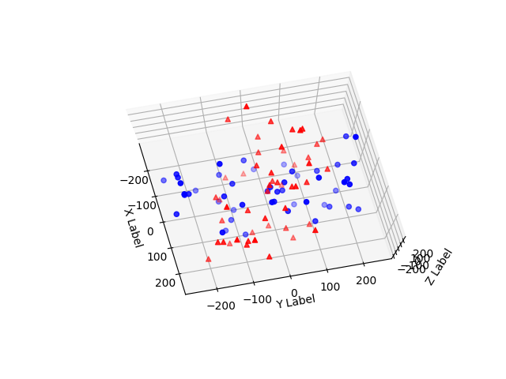

# Rotation-Matrix
The [main.py](https://github.com/mauckc/rotation-matrix/blob/master/main.py) program loads a binary file containing 3D point cloud data formated as a list of 3-tuples (floats) corresponding to the (x,y,z) coordinates of a collection of points i.e. (point cloud). Then rotations about a user defined axis and magnitude (angle) are computed on each point. The original and resulting point clouds are visualized interactively.

## Setup
Requires Python and the installation of following packages
- numpy
- matplotlib

### Installation using pip
If using pip as your package manager you only need to type the following...
```PowerShell
pip install -r requirements
```
To install these packages

If you continue to run into problems with matplotlib toolkits...

try the following
```PowerShell
pip install -U matplotlib
```

If package import problems persist, please consider using a [virtual environment](https://docs.python-guide.org/dev/virtualenvs/).

## Usage
```PowerShell
C:\Users\rossm\devel\rotation-matrix> python .\main.py
```

Original Matrix
```
[[  50.    0.    0.    0.]
 [   1.    0. -209.  217.]
 [   2. -116. -250.  -81.]
 [   3.  -26.  228.  108.]
 [   4.  112.  214.  -45.]
 [   5.   95.   31.   77.]
 [   6.  -89.  241.  245.]
 [   7.   92.   77.  186.]
 ...
[  45.  100.  191.  -26.]
[  46.   16.  180. -143.]
[  47.   41. -243.   87.]
[  48.    7.   37.    3.]
[  49.   33.  195.  159.]
[  50.  -41.    8.  -29.]]
```
Rotated Matrix
```Shell
[[  50.            0.            0.            0.        ]
 [   1.          194.79616897  -75.73277069  217.        ]
 [   2.          190.97627197 -198.70597259  -81.        ]
 [   3.         -221.92621322   58.38455179  108.        ]
 [   4.         -158.8722959   181.93293709  -45.        ]
 [   5.            5.53077501   99.77680356   77.        ]
 ...
[  46.         -161.9693114    80.13702118 -143.        ]
[  47.          241.34216582  -49.83933181   87.        ]
[  48.          -31.9489419    19.93151052    3.        ]
[  49.         -169.78981587  101.41705196  159.        ]
[  50.          -22.31298062  -35.31474049  -29.        ]]
```

### Interactive Plots
Original and Rotated points are shown in different colors


You can click and drag to rotate the viewpoint



## Information
See this [pdf](https://github.com/mauckc/rotation-matrix/blob/master/doc/my-solution-rotation-matrix.pdf) for explanation of the formula used to produce the rotation matrix function below

```python
# set rotation axis to be the z-axis
axis = [0., 0., 1.]
# set rotation degree in radians
theta = 1.2

def rotation_matrix(axis, theta):
    """
    Return the rotation matrix associated with counterclockwise rotation about
    the user specified axis by theta radians.
    """
    # convert the input to an array
    axis = np.asarray(axis)
    # Get unit vector of our axis
    axis = axis/math.sqrt(np.dot(axis, axis))
    # take the cosine of out rotation degree in radians
    a = math.cos(theta/2.0)
    # get the rest rotation matrix components
    b, c, d = -axis*math.sin(theta/2.0)
    # create squared terms
    aa, bb, cc, dd = a*a, b*b, c*c, d*d
    # create cross terms
    bc, ad, ac, ab, bd, cd = b*c, a*d, a*c, a*b, b*d, c*d
    # return our rotation matrix

    return np.array([[aa+bb-cc-dd, 2*(bc+ad), 2*(bd-ac)],
                     [2*(bc-ad), aa+cc-bb-dd, 2*(cd+ab)],
                     [2*(bd+ac), 2*(cd-ab), aa+dd-bb-cc]])
```

