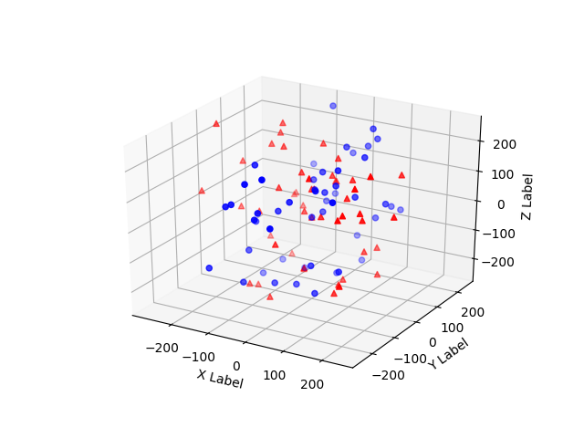

# Rotation-Matrix
This repo computes rotations of N points in 3D and interactively visualizes the original and resulting points

## Setup
Requires Python and the installation of following packages
- numpy
- matplotlib

### Installation using pip
If using pip as your package manager you only need to type the following...
```PowerShell
pip install -r requirements
```
To install these packages

If you continue to run into problems with matplotlib toolkits...

try the following
```PowerShell
pip install -U matplotlib
```

If package import problems persist, please consider using a [virtual environment](https://docs.python-guide.org/dev/virtualenvs/).

## Usage
```PowerShell
C:\Users\rossm\devel\rotation-matrix> python .\main.py
```

Original Matrix
```
[[  50.    0.    0.    0.]
 [   1.    0. -209.  217.]
 [   2. -116. -250.  -81.]
 [   3.  -26.  228.  108.]
 [   4.  112.  214.  -45.]
 [   5.   95.   31.   77.]
 [   6.  -89.  241.  245.]
 [   7.   92.   77.  186.]
 ...
[  45.  100.  191.  -26.]
[  46.   16.  180. -143.]
[  47.   41. -243.   87.]
[  48.    7.   37.    3.]
[  49.   33.  195.  159.]
[  50.  -41.    8.  -29.]]
```
Rotated Matrix
```Shell
[[  50.            0.            0.            0.        ]
 [   1.          194.79616897  -75.73277069  217.        ]
 [   2.          190.97627197 -198.70597259  -81.        ]
 [   3.         -221.92621322   58.38455179  108.        ]
 [   4.         -158.8722959   181.93293709  -45.        ]
 [   5.            5.53077501   99.77680356   77.        ]
 ...
[  46.         -161.9693114    80.13702118 -143.        ]
[  47.          241.34216582  -49.83933181   87.        ]
[  48.          -31.9489419    19.93151052    3.        ]
[  49.         -169.78981587  101.41705196  159.        ]
[  50.          -22.31298062  -35.31474049  -29.        ]]
```

### Interactive Plots
Original and Rotated points are shown in different colors



You can click and drag to rotate the viewpoint


